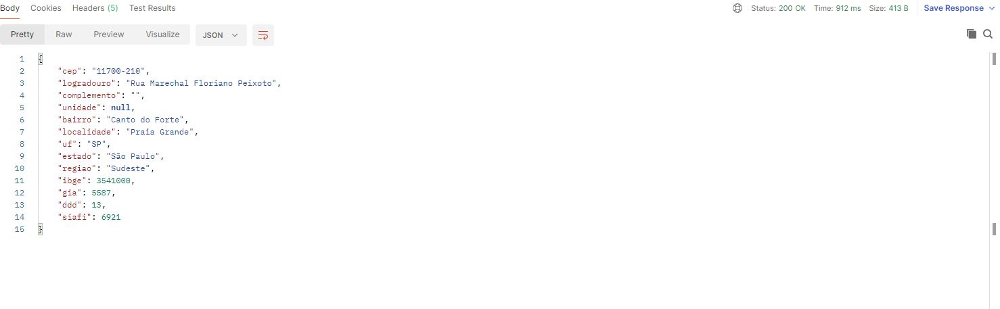
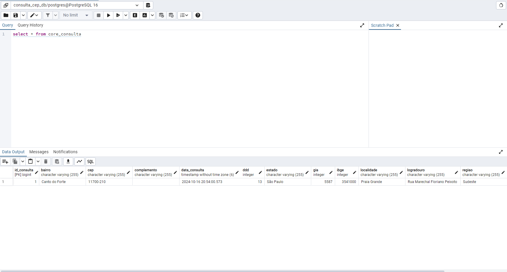

<br>
<h1 align="center">
Consulta de CEP 
</h1>
<br>

## 💬 Sobre o repositório

A aplicação consiste em um sistema para verificação de Código de Endereço Postal (CEP)

## ⚠ Pré-requisitos para execução do projeto

* Java 21
* Maven
* PostgresSQL

## 📌 Como utilizar?

Para utilizar o Consulta de CEP, é necessário ter uma instância de conexão do banco de dados ativa (no caso PostgresSQL), que por padrão fica na porta 5432, caso sua porta esteja diferente, especifique no application.yml em:

```
spring.datasource.url=jdbc:postgresql://postgresql:5432/consulta_cep_db?createDatabaseIfNotExist=true
spring.datasource.username=<USUARIO_BD>
spring.datasource.password=<SENHA_BD>
```

Com o banco de dados devidamente configurado, rode o [back-end da aplicação](https://github.com/wienerdev/sds) através do seguinte comando:

*Disponível em http://localhost:8081/

```
mvn spring-boot:run 
```

Com a aplicação rodando, envie uma requisição para o endpoint http://localhost:8081/api/v1/buscar-cep com o cep no body, como por exemplo:

```
{
    "cep" : "11700210"
}
```

### Exemplo de retorno:



A consulta ficará registrada em banco de dados, como evidenciado abaixo:

### Exemplo Endereço gravado em banco



## 🧠 Links importantes

* [Documentação oficial do Angular](https://angular.io/)
* [Site oficial do NodeJS](https://nodejs.org/en/)
* [Site oficial do NPM](https://www.npmjs.com/)
* [Referência para o padrão arquitetural REST](https://restfulapi.net/)
* [Palheta de atalhos de comandos do IntelliJ](https://resources.jetbrains.com/storage/products/intellij-idea/docs/IntelliJIDEA_ReferenceCard.pdf)
* [Site oficial do Spring](https://spring.io/)
* [Site oficial do Spring Initialzr para setup do projeto](https://start.spring.io/)
* [SDKMan! para gerenciamento e instalação do Java e Maven](https://sdkman.io/)
* [Site oficial do MySQL](https://www.mysql.com/)

---
